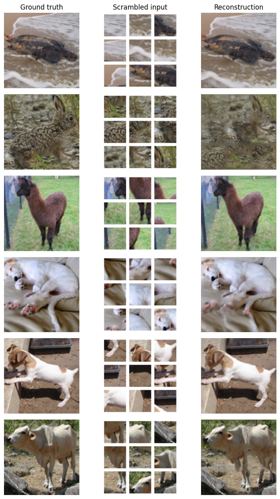

# Jigsaw Puzzle Reconstruction with Deep Learning

This project reconstructs a 96x96 RGB image from 9 shuffled and eroded image patches. It was built as a deep learning experiment around visual reasoning: the model has to infer patch placement and fill missing borders without being given true patch-position labels.

The notebook uses the STL-10 unlabeled image set, generates puzzle-style inputs on the fly, compares against a simple baseline, and evaluates a TensorFlow/Keras model that combines shared CNN patch encoding, contextual reasoning, Sinkhorn-style assignment, and a refinement network.

## Highlights

- Reconstructs full images from 9 shuffled 28x28 RGB patches.
- Uses only reconstruction supervision, not explicit patch-position labels.
- Builds a custom data generator from STL-10 images.
- Includes a baseline, model architecture, training code, pretrained-weight loading, quantitative evaluation, and visual examples.
- Achieves a final test MAE of `0.04529`, compared with a baseline MAE of `0.1822`.

## Result Summary

| Model | Test MAE |
|---|---:|
| Simple baseline | 0.1822 |
| Final model | 0.04529 |

That is about a 75% MAE improvement over the baseline.

## Example Reconstructions

Random test examples — the original image, the shuffled and border-eroded patch
input the model receives, and its reconstruction:



## Repository Contents

| File | Purpose |
|---|---|
| `Jigsaw_Puzzle_Reconstruction.ipynb` | Main notebook with data generation, model, training code, evaluation, and visual results |
| `requirements.txt` | Python dependencies for running the notebook |
| `MODEL_CARD.md` | Short notes about the task, data, metrics, and limitations |
| `.gitignore` | Keeps generated data, checkpoints, caches, and local environments out of Git |

## How It Works

1. Download the STL-10 unlabeled image dataset.
2. Split each image into a 3x3 grid.
3. Remove a small border from each tile to create 28x28 eroded patches.
4. Shuffle the patches and use them as the model input.
5. Train the model to reconstruct the original 96x96 image.
6. Evaluate reconstruction quality with Mean Absolute Error.

## Quick Start

Create an environment and install dependencies:

```bash
python -m venv .venv
.venv/Scripts/python -m pip install -r requirements.txt
```

Open the notebook:

```bash
jupyter notebook Jigsaw_Puzzle_Reconstruction.ipynb
```

The notebook defaults to evaluation mode:

```python
RUN_TRAINING = False
```

In this mode, it downloads pretrained weights with `gdown` and runs evaluation. To train from scratch, set `RUN_TRAINING=True`. Training is GPU-heavy and can take a long time.

## Tech Stack

- Python
- TensorFlow / Keras
- NumPy
- Matplotlib
- STL-10 dataset
- gdown for checkpoint download

## Notes

The pretrained weights are downloaded at runtime instead of being committed to the repository, keeping the GitHub repo lightweight. Generated datasets, model checkpoints, and local virtual environments are ignored by Git.
